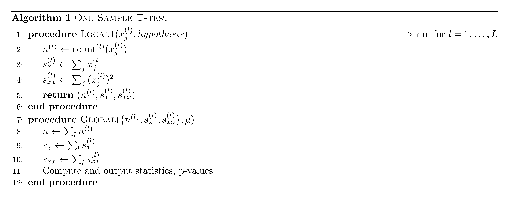

<b><h2>
One Sample T-Test  
</h1></b>

<b><h4> Some General Remarks </h4></b>
The general architecture of the MIP follows a Master/Worker paradigm where many Workers, operating in multiple medical centers, are coordinated by one Master. Only Workers are allowed access to the anonymized data in each medical center and the Master only sees aggregate data, derived from the full data and sent to him by the Workers.

As a consequence, every algorithm has to be refactored in a form that fits this model.

In general, this means two things.

1. On the one hand, isolating the parts of the algorithm that operate on the full data and implement them in procedures that run on Workers.
1. On the other hand, identifying the parts of the algorithm that need to see the aggregates from all Workers and implementing these parts in procedures that run on Master.

Our naming convention is that procedures run on Workers are given the adjective _local_ whereas those running on Master are called _global_.

<b><h4> Notation </h4></b>
Each local dataset *D(l)*, where *l*=1,...,*L*, is represented as a matrix of size *n* x *p*, where *L* is the number of medical centers, *n* is the number of points (patients) and *p* is the number of  attributes. The elements of the above matrix can either be continuous or discrete (categorical).

In each local dataset, the independent attributes are denoted as a matrix *X(l)* and the dependent variable is denoted as a vector *y(l)*. *x*(*ij*)(*l*) is the value of the *i*(*th*) patient of the *j*(*th*) attribute in the *l*(*th*) hospital, while *x*(*j*)(*l*) denotes the vector of the *j*(*th*) attribute in the *l*(*th*) hospital. For categorical attributes,  we use the notation *C*m  { *C*1, *C*2, ..., *C*M} for their domain.

<b><h4> Algorithm Description </h4></b>
The Student’s One-sample t-test is used to test the null hypothesis that the true mean is equal to a particular value (typically zero). A low p-value suggests that the null hypothesis is not true, and therefore the true mean (μ) must be different from the test value. In each local dataset, let *xj* be the variable of interest.

<b><h4>Algorithm Implementation</b></h4>

[One Sample T-test](../../exareme2/algorithms/ttest_onesample.py)
