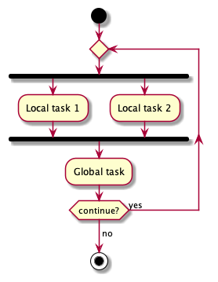
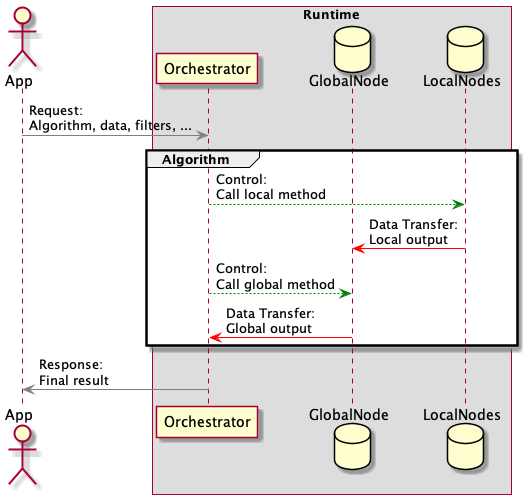
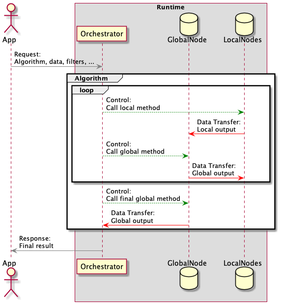
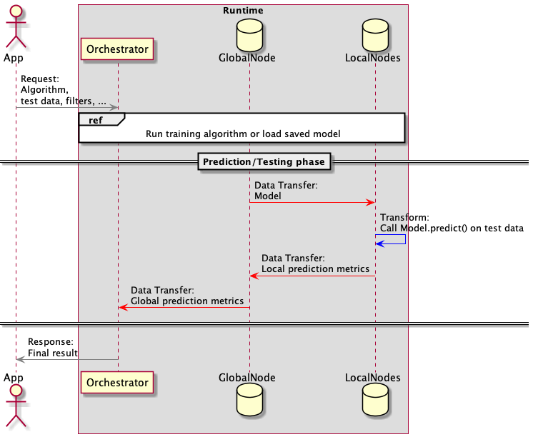
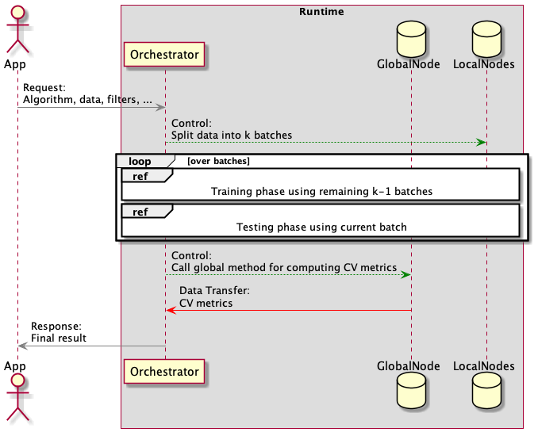
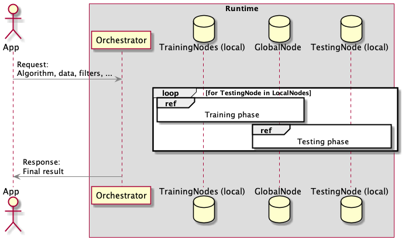
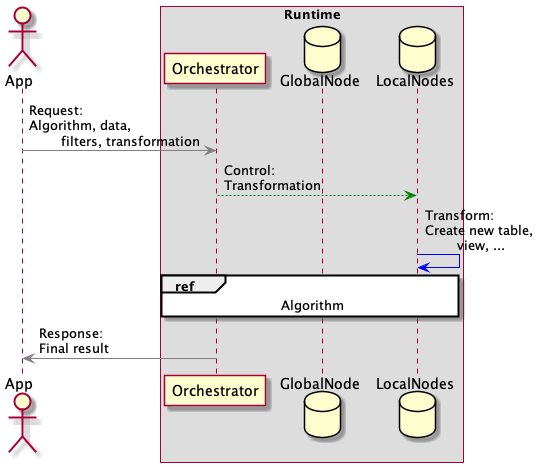
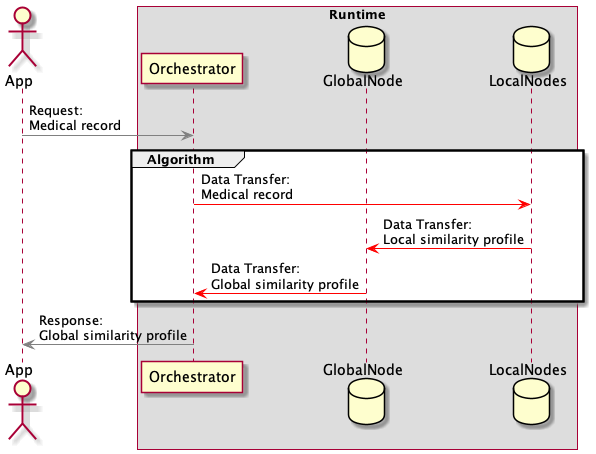

# User stories

#### Definitions

* In what follows, an **algorithm** is understood as being a *statistics* or
  *machine learning* algorithm which typically expects some data tables as input and outputs a *model* and/or some *
  statistics*. This model can be of interest to the user on its own, or can be used in further computations.
* **Federated** algorithm means that the work is divided into smaller tasks, each executed on a different **worker** of
  the federation. The primary consideration of this design is the preservation of data privacy. One worker is special,
  named `global worker`, and doesn't contain any primary data. All other workers, named `local workers` contain their own data
  which they are not allowed to share with other workers. The following diagram illustrates the execution flow of a
  federated algorithm.

*Federated algorithm execution flow*

The horizontal bars represent synchronization points. The number of local tasks can vary depending on the context. The
whole `local`/`global` step can be repeated any number of times.

#### Sequence diagrams

In what follows we present a number of sequence diagrams to accompany the user stories. These diagrams represent the
sequence of events for each setting where time flows from top to bottom. The color coding is
*green*: remote invocations,
*red*: data transfer and
*blue*: local transformation of data.

## User persona: Medical Researcher

Might be a doctor, a neuroscientist, a biologist, a pharmaceutical researcher or anyone interested in conducting
research with medical data. Might have a background in statistics/machine learning/data science, ranging from basic to
expert-level.

#### Basic federated analysis

A *medical researcher* wants to perform **basic federated analysis** on a set of
*medical centers*[1](#f1). This means running one *algorithm*
on a dataset which is scattered across multiple medical centers.

The following *sequence* diagrams illustrate the sequence of events in such setting.

*Single step algorithm*

*Multi step algorithm*

#### Prediction

A *medical researcher* wants to use a previously trained model to perform
**prediction** on some new medical records.

*Prediction/Testing*

#### Cross-validation

A *medical researcher* wants to **cross-validate** her models in order to asses the quality of fit. The user wants to
choose among multiple CV strategies.

* *k-fold* CV, medical-center-agnostic.
* *Cluster* CV where a cluster here corresponds a medical center.

*k-fold cross-validation*

*Cluster cross-validation*

#### Model selection

A *medical researcher* wants to perform formalized **model selection**. After training multiple models on the same
dataset, the user wants to select the
*best* one according to criteria usually related to the model's prediction/cross-validation performance.

*Model selection*

#### Data preprocessing/transformations

A *medical researcher* wants to be able to **pre-process data** using a variety of tools.

* In simple cases the pre-processing can be done **locally** in each medical center. *E.g.* creating interaction
  terms, *i.e.* creating new columns as products of existing ones.
* In other cases the pre-processing itself needs to happen **globally**.
  *E.g.* centering or standardizing data.

*Local data transformation*

*Global data transformation*

#### Algorithm pipelines

A *medical researcher* wants to run **algorithm pipelines**. Typical flow: one algorithm run results in a model. This
model is used to transform some data
(*e.g.* via prediction). The transformed data is inputted to the next algorithm etc.

*Algorithm pipeline*

#### Similarity search

A *medical researcher* wants to perform **similarity search** across different medical centers. Given a small number (
possibly one) of patients located in some medical center or whose medical record is inputted manually by the user, find
other medical centers hosting *similar* cases. Similarity can have multiple definitions.

*Similarity search*

#### Saving

A *medical researcher* wants to **save elements of her computations** for later use. These element can be models,
data-views, transformed datasets etc.

## User persona: Algorithm Developer

A third party algorithm developer (as opposed to the developer of native algorithms).

* An **algorithm developer** wants to supply the federation with her own algorithm, written in some machine learning
  friendly language (python, R, ...). Ideally:
    * The user is agnostic of the inner workings of the system, only being aware of the existence of many local and one
      global workers.
    * The system enforces privacy restrictions independently of how the algorithm is written.

---
<b id="f1">1</b> A **medical center** is understood as being a member of the federation. It stores and contributes data
in the form of medical records as well as some computing power. It is potentially geographically distinct from other
medical centers.[^](#a1) 
